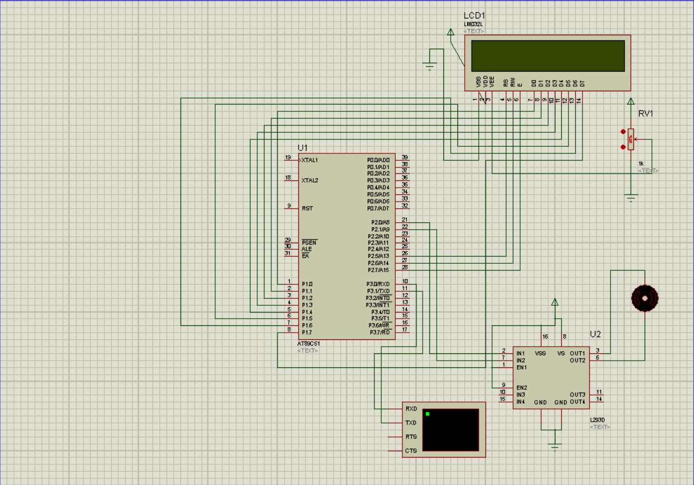
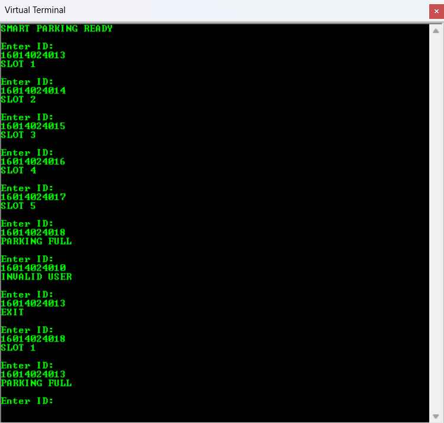

# 🚗 RFID Smart Parking System (8051)

## 📌 Overview

This project implements a **Smart Parking System using the AT89C51 (8051) microcontroller**.
It dynamically allocates parking slots, tracks vehicle entry and exit, and prevents over-parking using embedded system logic.

The system is simulated in **Proteus** and programmed using **Embedded C in Keil µVision**.

---

## 🚗 Features

* 🔹 Dynamic slot allocation (5 slots)
* 🔹 Entry and exit tracking for each user
* 🔹 Parking full detection
* 🔹 Invalid user detection
* 🔹 LCD display for real-time status
* 🔹 Virtual Terminal for RFID simulation
* 🔹 Motor-based gate control (via L293D)

---

## 🛠️ Technologies Used

* **Microcontroller:** AT89C51 (8051)
* **Programming:** Embedded C (Keil µVision)
* **Simulation:** Proteus ISIS Professional
* **Communication:** UART (Virtual Terminal)

---

## ⚙️ Working Principle

1. System initializes LCD and UART communication
2. User enters RFID ID via Virtual Terminal
3. Microcontroller verifies the ID

* ✅ Valid User:

  * If entering → Assign slot
  * If already inside → Exit & free slot

* ❌ Invalid User:

  * Access denied

4. If all slots are occupied:

   * System displays **"PARKING FULL"**

5. LCD displays:

   * User name
   * Slot number

6. Motor simulates gate opening and closing

---

## 📸 Project Demonstration

### 🔌 Circuit Diagram



### 💻 Output (Virtual Terminal)



---

## ▶️ How to Run

1. Open the Proteus project file
2. Load the `.hex` file into the microcontroller
3. Run the simulation
4. Enter RFID IDs in the Virtual Terminal

---

## 🧪 Sample Inputs

### ✔ Valid Users:

```
16014024013
16014024014
16014024015
16014024016
16014024017
16014024018
```

### ❌ Invalid Input:

```
12345678901
```

---

## 💯 Output Behavior

* Assigns slots dynamically (1–5)
* Frees slot on exit
* Shows **PARKING FULL** when full
* Displays **INVALID USER** for unknown IDs

---

## 🎯 Applications

* Smart parking systems
* Access control systems
* Residential parking automation
* Office parking management

---

## 👨‍💻 Author

**Purv Doshi**

---

## ⭐ Project Highlights

* Real-time embedded system simulation
* Efficient slot management using arrays
* UART-based RFID emulation
* Clean and optimized 8051 code

---

## 📌 Future Improvements

* Real RFID hardware integration
* IR sensors for automatic slot detection
* Mobile app integration
* Database connectivity for logging

---
